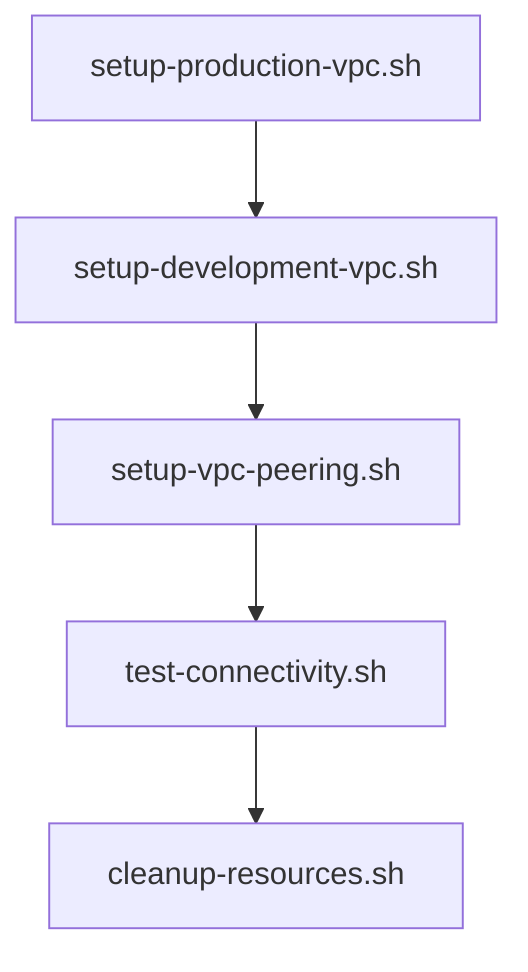

# AWS VPC Scripts

This folder contains automation scripts for deploying and managing the AWS VPC Multi-Tier Architecture case study.

## 🚀 Quick Start

### Prerequisites
- AWS CLI configured with appropriate permissions
- Bash shell (Linux/Mac) or WSL (Windows)
- IAM permissions for VPC, EC2, and related services

### Usage Instructions

1. **Make scripts executable:**
   ```bash
   chmod +x *.sh
   ```

2. **Run scripts in order:**
   ```bash
   ./setup-production-vpc.sh      # Creates Production VPC
   ./setup-development-vpc.sh     # Creates Development VPC  
   ./setup-vpc-peering.sh         # Sets up VPC peering
   ./test-connectivity.sh         # Tests network connectivity
   ```

3. **When done, cleanup resources:**
   ```bash
   ./cleanup-resources.sh         # Removes all resources
   ```

## 📋 Script Details

### 🏗️ `setup-production-vpc.sh`
- Creates Production VPC (10.0.0.0/16)
- Sets up 5 subnets (Web, App1, App2, DBCache, DB)
- Configures NAT Gateway and routing
- **Runtime**: ~5-10 minutes

### 🏢 `setup-development-vpc.sh`
- Creates Development VPC (10.1.0.0/16)
- Sets up 2 subnets (Dev-Web, Dev-DB)
- Configures basic routing
- **Runtime**: ~2-3 minutes

### 🔗 `setup-vpc-peering.sh`
- Creates peering connection between VPCs
- Updates route tables for cross-VPC communication
- **Runtime**: ~1-2 minutes

### 🧪 `test-connectivity.sh`
- Validates internet connectivity
- Checks VPC peering status
- Provides manual testing instructions
- **Runtime**: ~30 seconds

### 🧹 `cleanup-resources.sh`
- Safely deletes all created resources
- Includes confirmation prompt
- Releases Elastic IPs and stops charges
- **Runtime**: ~5-10 minutes

## ⚠️ Important Notes

- **Costs**: NAT Gateway costs ~$45/month - remember to cleanup!
- **Regions**: Scripts default to us-east-1
- **Error Handling**: Scripts use `set -e` to stop on errors
- **Confirmation**: Cleanup script requires "yes" confirmation

## 💡 Customization

To modify for different regions or CIDR blocks, edit the variables at the top of each script:

```bash
# Configuration Variables
REGION="us-east-1"
VPC_CIDR="10.0.0.0/16"
AZ_A="us-east-1a"
AZ_B="us-east-1b"
```

## 🔍 Troubleshooting

**Script fails with permissions error:**
- Check AWS CLI configuration: `aws configure list`
- Verify IAM permissions for VPC and EC2 services

**NAT Gateway creation timeout:**
- Wait for completion - can take 5-10 minutes
- Check AWS console for status

**Cleanup fails:**
- Run cleanup script again - it's designed to handle partial failures
- Manually delete remaining resources via AWS console if needed

## 📊 Expected Output

Each script provides colored output with:
- ✅ Success indicators
- ⚠️ Warnings and info
- 🔍 Resource IDs and details
- 💡 Next steps

## 🎯 Script Execution Order



---

**Remember**: Always run cleanup when done to avoid unnecessary AWS charges!
